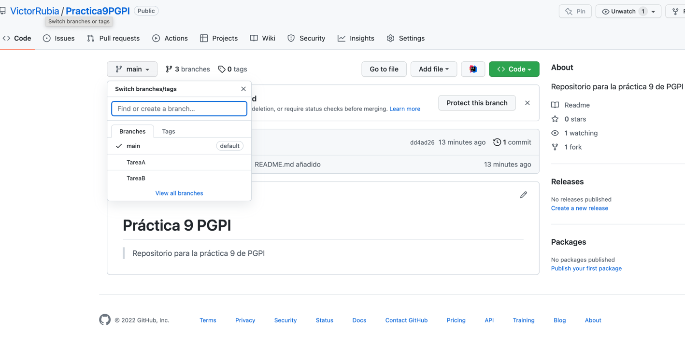
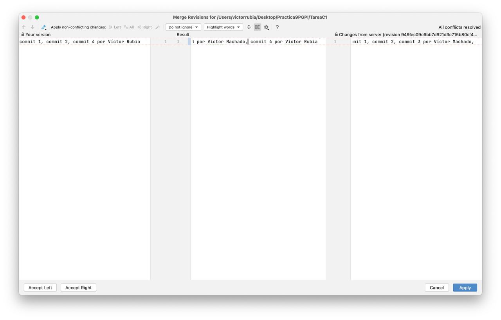

# Práctica 9 PGPI

> Repositorio para la práctica 9 de PGPI

### Responsable de Proyecto

Víctor José Rubia López

### Responsable de tarea A

Víctor Machado Fernández

### Responsable de tarea B

Sergio Mesas Yélamos

### Responsable de tarea C

Víctor José Rubia López

## Realización de tareas

**1. Ramas existentes**:



En la rama Tarea A y Tarea B se han creado los archivos correspondientes a las Tareas A y B por parte de los responsables de cada tarea.

**2. Finalización de la tarea A**

Los comandos realizados para unirlos a la rama main son los siguientes

```bash
# Añadimos los nuevos archivos creados en la rama 
$ git add * 
$ git commit -m "comentario" 
$ git push 
# Cambiamos a la rama develop para ponerla al día 
$ git checkout main
$ git pull 
# Volvemos a nuestra rama para ponerla al día 
$ git checkout TareaA
$ git rebase main
$ git push 
# Finalmente unimos la rama desde develop 
$ git checkout main
$ git merge TareaA
$ git push
# Borramos la rama finalizada
$ git branch -d TareaA
```

**3. Resolver conflictos rama Tarea C**



Así resolvemos el conflicto a la hora de hacer push en el repositorio sin haber hecho pull antes.

**4. Versión del software**

Ejecutamos el siguiente comando

```bash
$ git tag v1.0.0
```

